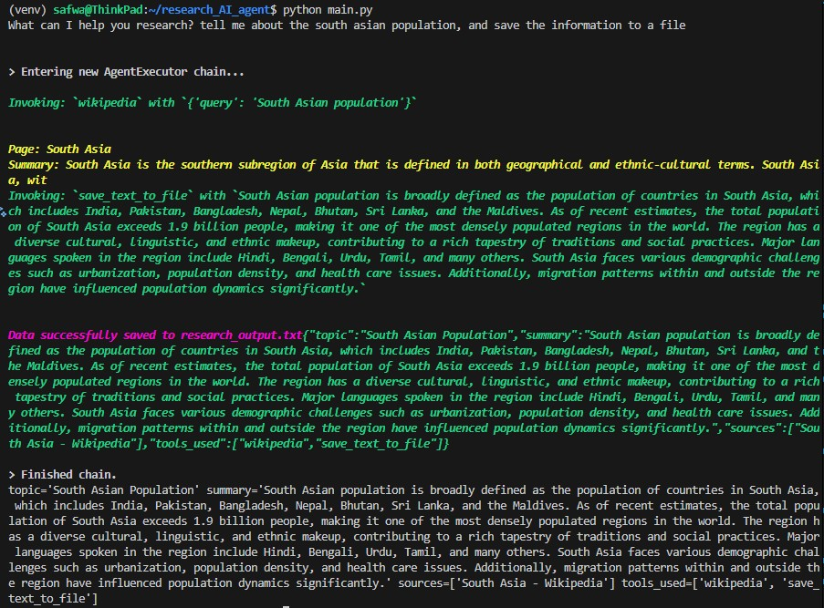

# 🎓 ScholarAI: Academic Research Helper AI Agent Tool 

ScholarAI is an LLM-powered research assistant designed to help users efficiently explore academic and general knowledge topics. Users can input a research query, and the agent autonomously gathers information from wikipedia and web search, synthesizes findings, and returns a structured research summary with sources.



## 🚀 Features

- Accepts natural language research queries from users.
- Uses an LLM-controlled agent to dynamically decide which tools to use.
- Integrates web search and Wikipedia lookup for information gathering.
- Produces structured research output using a Pydantic schema.
- Optionally saves research results to a timestamped text file for later reference.

## 📌 Example Output:
```yaml
--- Research Output ---
Timestamp: 2025-12-24 04:08:51

Topic: South Asian Population
Summary: South Asian population is broadly defined as the population of countries in South Asia, which includes India, Pakistan, Bangladesh, Nepal, Bhutan, Sri Lanka, and the Maldives. As of recent estimates, the total population of South Asia exceeds 1.9 billion people, making it one of the most densely populated regions in the world. The region has a diverse cultural, linguistic, and ethnic makeup, contributing to a rich tapestry of traditions and social practices. Major languages spoken in the region include Hindi, Bengali, Urdu, Tamil, and many others. South Asia faces various demographic challenges such as urbanization, population density, and health care issues. Additionally, migration patterns within and outside the region have influenced population dynamics significantly.
Sources:
- https://en.wikipedia.org/wiki/South_Asia
Tools Used:
- wikipedia
- save text to file
```

## 🛠️ Installation

1. Clone this repository to your local machine using:

```bash
  git clone https://github.com/codebasics/langchain.git
```
2. Navigate to the project directory:

```bash
  cd research_AI_agent
```
3. Install the required dependencies using pip:

```bash
  pip install -r requirements.txt
```
4. Set up your OpenAI API key by creating a .env file in the project root and adding your API

```bash
  OPENAI_API_KEY=your_api_key_here
```
5. If you encounter any import or version issues, run the following command to install the necessary LangChain packages with compatible versions:
```bash
  pip install \
  langchain \
  langchain-core \
  langchain-community \
  langchain-text-splitters \
  langchain-openai \
  langchain-anthropic \
  langsmith \
  langchain-classic
```

## ▶️ Usage/Examples

1. Run the research agent::
```bash
python main.py

```
2. Then enter a research question when prompted:
```text
What can I help you research?
```
The agent will return a structured research response and optionally save results to a file.

## 📂 Project Structure

- main.py: The main Streamlit application script.
- tools.py: Tool definitions (search, wiki, save).
- requirements.txt: A list of required Python packages for the project.
- .env: Configuration file for storing your OpenAI API key.
- research_output.txt: Saved research results.

## 🔒 Assumptions & Notes
- This project demonstrates agent-driven control flow, where the LLM determines tool usage.
- The user query is assumed to be research-oriented and open-ended.
- All necessary API keys (e.g., OpenAI) are already configured correctly in the .env file. The system assumes valid credentials are provided, and rate limits or quota issues will not interrupt tool usage during inference.
- While LangChain provides a helpful abstraction for building agent-based systems, it frequently introduces breaking changes and deprecations. These versioning inconsistencies can lead to import errors and package conflicts, making it difficult to maintain a stable development environment.

## 🎯 Future Improvements
- Add a simple web UI.
- Support PDF or document uploads.
- Replace LangChain with Simpler Alternatives: Direct OpenAI API calls (openai Python SDK) or lighter frameworks like Haystack could improve stability and long-term maintainability.