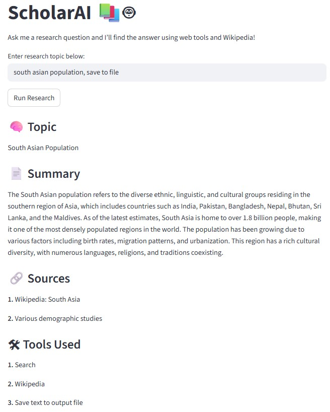

# 🎓 ScholarAI: Academic Research Helper AI Agent Tool 

ScholarAI is an LLM-powered research assistant that helps users explore academic and general knowledge topics through an interactive Streamlit web interface. Users enter a research query, and the agent autonomously gathers information from Wikipedia and web search tools, synthesizes findings, and returns a structured research summary with sources.



## 🚀 Features

- Interactive Streamlit dashboard accepts natural language research queries from users.
- LLM-controlled agent that dynamically selects tools (Wikipedia, web search).
- Integrates web search and Wikipedia lookup for information gathering.
- Generates a clear research topic, summary, sources, and tools used.
- Optionally saves research results to a timestamped text file for later reference.

## 📌 Example Output Saved to Text File:
```yaml
--- Research Output ---
Timestamp: 2025-12-25 20:48:23

Sharks are a group of elasmobranch fish characterized by a cartilaginous skeleton, a streamlined body, and a strong set of jaws. They are found in oceans worldwide, and their ecological role is crucial, as they occupy the upper tiers of the food chain. There are over 500 species of sharks, ranging from the small dwarf lanternshark to the enormous whale shark. Sharks are known for their acute senses, particularly their ability to detect electric fields in the water and their keen sense of smell. They are often misunderstood and portrayed as dangerous predators, but many species are vital to marine ecosystems and are threatened by human activities such as fishing and habitat destruction.

--- Research Output ---
Timestamp: 2025-12-25 20:54:58

South Asian Population Statistics:

- The South Asian population in Canada grew to nearly 2.6 million people in 2021, making them the largest racialized group in the country.
- They represent 7.1% of the total population.
- This growth is notable as it nearly quadrupled from 669,060 people in 1996, when South Asians made up 2.4% of the population.
- The statistics are based on the Census of Population long-form questionnaire from Statistics Canada.
```

## 🛠️ Installation

1. Clone this repository to your local machine using:

```bash
  git clone https://github.com/safwanjamal1/ScholarAI.git
```
2. Navigate to the project directory:

```bash
  cd ScholarAI
```
3. Install the required dependencies using pip:

```bash
  pip install -r requirements.txt
```
4. Set up your OpenAI API key by creating a .env file in the project root and adding your API

```bash
  OPENAI_API_KEY=your_api_key_here
```
5. If you encounter any import or version issues, run the following command to install the necessary LangChain packages with compatible versions:
```bash
  pip install \
  langchain \
  langchain-core \
  langchain-community \
  langchain-text-splitters \
  langchain-openai \
  langchain-anthropic \
  langsmith \
  langchain-classic
```

## ▶️ Usage/Examples

1. Run the research agent streamlit application:
```bash
streamlit run main.py
```
2. Enter a research question in the query field in streamlit:


The agent will return a structured research response and optionally save results to a file.

## 📂 Project Structure

- main.py: The main Streamlit application script.
- tools.py: Tool definitions (search, wiki, save).
- requirements.txt: A list of required Python packages for the project.
- .env: Configuration file for storing your OpenAI API key.
- research_output.txt: Saved research results.

## 🔒 Assumptions & Notes
- This project demonstrates agent-driven control flow, where the LLM determines tool usage.
- The user query is assumed to be research-oriented and open-ended.
- All necessary API keys (e.g., OpenAI) are already configured correctly in the .env file. The system assumes valid credentials are provided, and rate limits or quota issues will not interrupt tool usage during inference.
- While LangChain provides a helpful abstraction for building agent-based systems, it frequently introduces breaking changes and deprecations. These versioning inconsistencies can lead to import errors and package conflicts, making it difficult to maintain a stable development environment.

## 🎯 Future Improvements
- Support PDF or document uploads.
- Replace LangChain with Simpler Alternatives: Direct OpenAI API calls (openai Python SDK) or lighter frameworks like Haystack could improve stability and long-term maintainability.